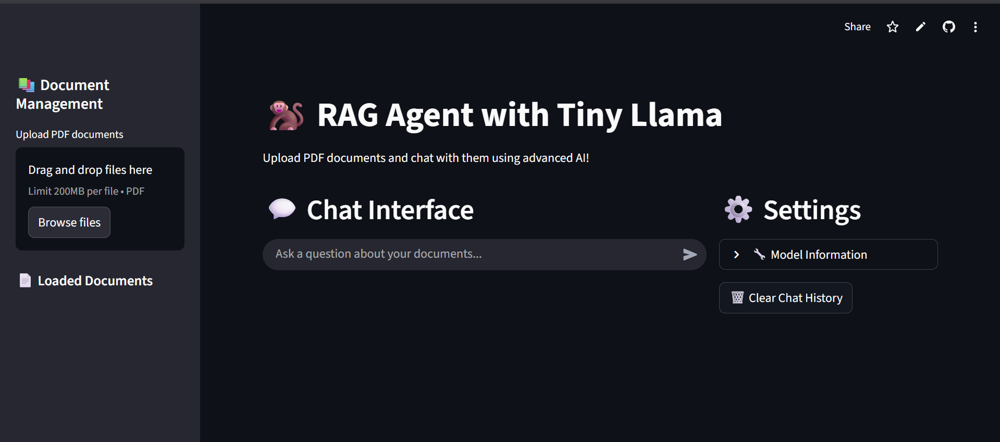

# RAG_w_Tiny_LLaMa 🚀

 <!-- Replace with your actual screenshot path -->

An advanced Retrieval-Augmented Generation (RAG) platform powered by Tiny LLaMa!  
This project melds the power of lightweight LLMs with smart document retrieval, providing fast, interactive, and context-aware responses for your data.

---

## 🌟 Features

- **Lightning Fast Document Search:**  
  Instantly find relevant info from your knowledge base.

- **Tiny LLaMa Integration:**  
  Efficient, high-performance large language model for smart answers.

- **Beautiful, Interactive UI:**  
  Intuitive design, real-time feedback, and smooth user experience.

- **Plug-and-Play Data Sources:**  
  Easily add new documents or connect external APIs.

- **Customizable Retrieval Pipeline:**  
  Tune to your needs—semantic, keyword, or hybrid search.

- **Secure & Extensible:**  
  Built with best practices for privacy and modularity.

---

## 🖼️ Demo

  
*Above: The sleek, interactive dashboard for RAG_w_Tiny_LLaMa*  
<!-- Replace with your actual screenshot file or external link -->

---

## 🚀 Quickstart

1. **Clone the repo:**
   ```bash
   git clone https://github.com/MiKecantdothis/RAG_w_Tiny_LLaMa.git
   cd RAG_w_Tiny_LLaMa
   ```

2. **Install dependencies:**
   ```bash
   pip install -r requirements.txt
   # Or use your preferred package manager
   ```

3. **Run the app:**
   ```bash
   python main.py
   # Or use: streamlit run app.py  (if using Streamlit UI)
   ```

4. **Open your browser:**  
   Navigate to `http://localhost:8501` (or the configured port).

---

## 🧠 How It Works

1. **User Query:**  
   Input your question or prompt in the UI.

2. **Retrieval Engine:**  
   The system fetches relevant documents using advanced search algorithms.

3. **Tiny LLaMa Model:**  
   Generates a smart, context-aware response based on both your query and retrieved data.

4. **Interactive Feedback:**  
   See results instantly, refine your search, and export answers as needed.

---

## 🛠️ Tech Stack

- **Python** (Core logic & backend)
- **Streamlit / Flask** (UI)
- **Tiny LLaMa** (Language Model)
- **FAISS**

---

## 📦 Contributing

We 💖 contributions!  
- Fork the repo
- Create a feature branch (`git checkout -b amazing-feature`)
- Commit your changes
- Submit a Pull Request

---

## 🙌 Acknowledgements

- [Tiny LLaMa](https://github.com/MiKecantdothis/Tiny_LLaMa)
- [Streamlit](https://streamlit.io/)
- [FAISS](https://github.com/facebookresearch/faiss)

---

## 📄 License

This project is licensed under the MIT License.

---

## 🤩 Try It Now!

Ready to experience supercharged document Q&A?  
**Clone, run, and ask away!**

---

<!-- Replace the screenshot above with your actual UI image for a polished look. -->
